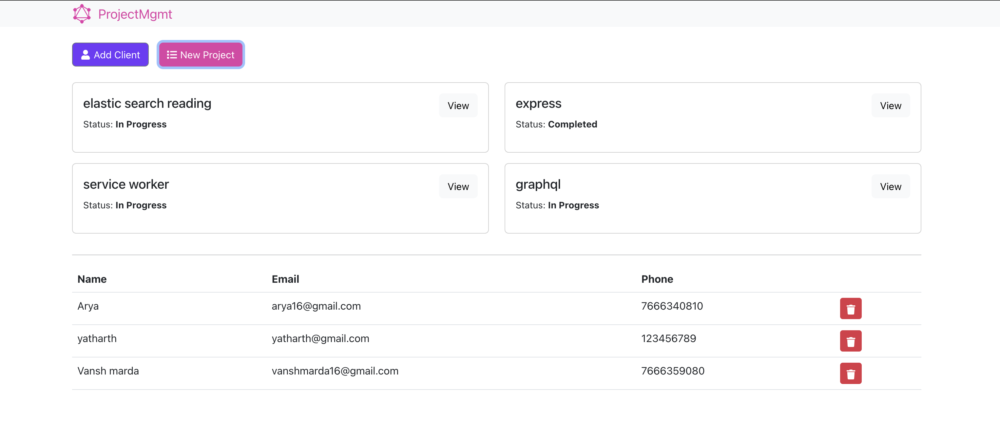
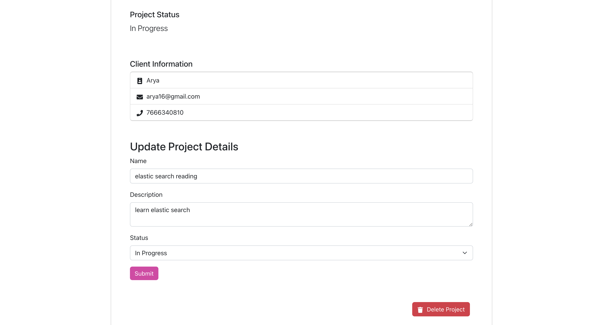

# Project Mgmt App


## Prerequisites

- Node.js (https://nodejs.org/)
- npm (Node Package Manager, comes with Node.js)

## Getting Started

### Backend Setup

1. Navigate to the `Backend` directory:

    ```sh
    cd Backend
    ```
    
2. Install the required dependencies:

    ```sh
    npm install
    ```
    
3. Start the backend server:

    ```sh
    node index.js
    ```

   The backend server will run on `http://localhost:5000`.

### Frontend Setup

1. Open a new terminal window/tab and navigate to the `Frontend` directory:

    ```sh
    cd Frontend
    ```

2. Install the required dependencies:

    ```sh
    npm install
    ```

3. Start the frontend development server:

    ```sh
    npm start
    ```

   The frontend server will run on `http://localhost:3000`.

## Funtionalities:
1. Add client
2. Delete Client
3. Add project
4. Delete project
5. Edit project

### before starting the backend please paste your mongodb URL in db.js


